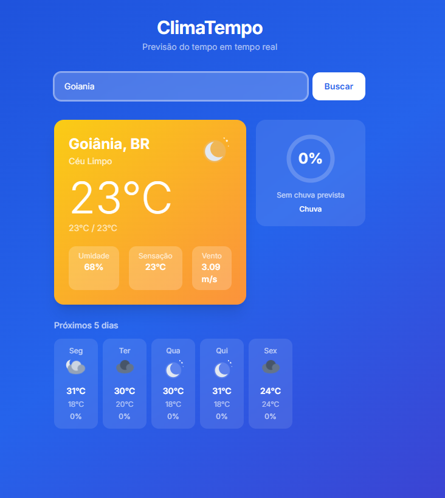
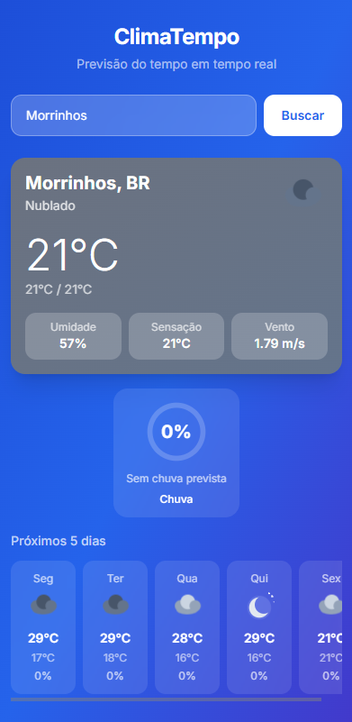

# ClimaTempo

[](https://github.com/Cleitim/ClimaTempo/releases/tag/v1.0.0)
[](./LICENSE)

Aplicação web frontend com arquitetura MVC que consome a API do OpenWeatherMap e exibe temperatura, umidade, probabilidade de chuva e previsão de 5 dias para qualquer cidade buscada.

## Demonstração

<table>
  <tr>
    <td align="center"><b>Desktop (1280px)</b></td>
    <td align="center"><b>Mobile (375px)</b></td>
  </tr>
  <tr>
    <td></td>
    <td></td>
  </tr>
</table>

> 🔗 **Deploy:** [ct-akci-502gevziw-cleitimhos-2939s-projects.vercel.app](https://ct-akci-502gevziw-cleitimhos-2939s-projects.vercel.app/)

---

## Tecnologias

| Camada | Tecnologia |
|---|---|
| Framework | React 18 + Vite 5 |
| Estilo | Tailwind CSS 3 |
| HTTP | Axios |
| Estado | React Context API + useReducer |
| Testes | Vitest + React Testing Library |
| Lint | ESLint 8 |
| Deploy | Vercel |

---

## Funcionalidades

- Busca de cidade por nome com validação de entrada
- Temperatura atual, mínima e máxima do dia
- Umidade relativa do ar e sensação térmica
- Probabilidade de chuva com indicador visual circular (0–100%)
- Previsão dos próximos 5 dias com ícone e temperatura
- Cache da última busca por 10 min via `localStorage`
- Layout responsivo mobile-first (375px → 1920px)
- Skeleton loading e tratamento de erros inline

---

## Como rodar localmente

### Pré-requisitos

| Ferramenta | Versão mínima |
|---|---|
| Node.js | 18 (use `.nvmrc` com `nvm use`) |
| npm | 9 |
| Conta OpenWeatherMap | Gratuita — [criar conta](https://home.openweathermap.org/users/sign_up) |

> **Atenção:** chaves de API recém-criadas no OpenWeatherMap podem levar até **2 horas** para ativar. Se a busca retornar erro 401, aguarde e tente novamente.

### 1. Clonar e instalar

```bash
git clone https://github.com/Cleitim/ClimaTempo.git
cd ClimaTempo
nvm use        # aplica a versão do .nvmrc (Node 18)
npm install
```

### 2. Configurar variáveis de ambiente

Copie o arquivo de exemplo e preencha sua chave:

```bash
cp .env.example .env
```

Edite o `.env`:

```env
VITE_OPENWEATHER_API_KEY=sua_chave_aqui   # obtenha em: openweathermap.org/api_keys
VITE_API_BASE_URL=https://api.openweathermap.org/data/2.5
VITE_CACHE_TTL_MINUTES=10
```

### 3. Verificar o ambiente (smoke test)

```bash
npm run build   # deve terminar sem erros antes de subir o dev
```

### 4. Iniciar em desenvolvimento

```bash
npm run dev
```

Acesse `http://localhost:5173`

### Build de produção

```bash
npm run build    # gera dist/
npm run preview  # serve o bundle localmente para validação
```

---

## Scripts disponíveis

| Comando | O que faz |
|---|---|
| `npm run dev` | Inicia o servidor de desenvolvimento (HMR) |
| `npm run build` | Gera o bundle de produção em `dist/` |
| `npm run preview` | Serve o bundle de produção localmente |
| `npm run test` | Roda os testes em modo watch |
| `npm run test -- --run` | Roda os testes uma vez e encerra |
| `npm run lint` | Verifica o código com ESLint |

---

## Estrutura do projeto

```
src/
├── models/          # Mapeamento de dados da API (WeatherModel, ForecastModel)
├── views/
│   ├── components/  # SearchBar, WeatherCard, ForecastList, RainIndicator, LoadingSpinner
│   └── pages/       # Home — orquestra os componentes
├── controllers/     # WeatherController (cache + busca), SearchController (validação)
├── services/        # WeatherService (API + models), weatherApi.js (HTTP puro)
├── context/         # WeatherContext — estado global + hooks seletores
└── utils/           # formatters.js (formatação e cálculos compartilhados)
```

**Fluxo de dados de uma busca:**

```
SearchBar → SearchController (valida) → WeatherController (cache)
  → WeatherService → weatherApi.js → OpenWeatherMap API
  → WeatherModel / ForecastModel → WeatherContext → componentes
```

> Detalhes completos da arquitetura em [`docs/escopo-mvp.md`](docs/escopo-mvp.md).

---

## Testes

Testes com **Vitest** + **React Testing Library**, cobrindo controllers, models, reducer e componentes.

### Rodar todos os testes

```bash
npm run test
```

Inicia no modo **watch** — reexecuta a cada arquivo salvo.

### Rodar uma vez (sem watch)

```bash
npm run test -- --run
```

### Rodar com saída detalhada

```bash
npm run test -- --reporter=verbose --run
```

### Rodar um arquivo específico

```bash
npm run test -- SearchController --run
npm run test -- WeatherModel --run
npm run test -- RainIndicator --run
```

### Cobertura atual (32 testes)

| Arquivo de teste | O que cobre |
|---|---|
| `SearchController.test.js` | `validateCity` — 6 casos de borda (vazio, 1 char, números, XSS, acento, espaços) |
| `WeatherModel.test.js` | `createWeatherModel` — campos ausentes (`main`, `weather`, `pop`, `wind`) |
| `ForecastModel.test.js` | `createForecastModel` — array vazio, null, acumulação min/max, slice 5 dias |
| `WeatherContext.reducer.test.js` | Reducer — `FETCH_START`, `FETCH_SUCCESS`, `FETCH_ERROR`, action desconhecida |
| `RainIndicator.test.jsx` | Cor e tooltip nos 6 valores de fronteira: 0%, 30%, 31%, 60%, 61%, 100% |

Os arquivos ficam em `src/__tests__/`. Resultados da última execução: [`docs/test-results.md`](docs/test-results.md).

---

## Deploy (Vercel)

### Primeiro deploy

1. Acesse [vercel.com](https://vercel.com) e importe o repositório `Cleitim/ClimaTempo`
2. Framework preset: **Vite** (detectado automaticamente)
3. Em **Environment Variables**, adicione:

| Variável | Valor |
|---|---|
| `VITE_OPENWEATHER_API_KEY` | sua chave do OpenWeatherMap |
| `VITE_API_BASE_URL` | `https://api.openweathermap.org/data/2.5` |
| `VITE_CACHE_TTL_MINUTES` | `10` |

4. Clique em **Deploy**

### Deploy contínuo

O projeto está publicado em: [ct-akci-502gevziw-cleitimhos-2939s-projects.vercel.app](https://ct-akci-502gevziw-cleitimhos-2939s-projects.vercel.app/)

A cada push na branch `master`, o Vercel dispara o build e publica automaticamente. Nenhuma configuração adicional é necessária.

---

## Documentação

| Documento | Descrição |
|---|---|
| [`docs/escopo-mvp.md`](docs/escopo-mvp.md) | Visão geral, arquitetura MVC e requisitos do MVP |
| [`docs/backlog.md`](docs/backlog.md) | Backlog com IDs RF/RT e critérios de aceite por release |
| [`docs/diagrama-componentes.md`](docs/diagrama-componentes.md) | Diagrama Mermaid de componentes e fluxo de dados |
| [`docs/test-results.md`](docs/test-results.md) | Resultado da última execução dos testes |
| [`docs/prompts.md`](docs/prompts.md) | Histórico de prompts usados no desenvolvimento |

---

## Desenvolvimento assistido por IA

Este projeto foi desenvolvido com assistência do **Claude Sonnet** (Anthropic) via Claude Code.

Todos os prompts enviados ao longo do desenvolvimento estão documentados em [`docs/prompts.md`](docs/prompts.md), seguindo a estrutura:

```
Contexto  : descrição do estado atual
Objetivo  : o que se quer alcançar
Estilo    : formato ou padrão de resposta esperado
Resposta  : destino ou forma do output
```

Decisões de arquitetura rastreadas por prompt:

| Decisão | Prompt |
|---|---|
| Arquitetura MVC com React | Prompt 01 |
| Backlog em 3 releases (core / qualidade / entrega) | Prompt 02 |
| Diagrama Mermaid com camadas API/Service/Repository | Prompt 03 |
| Hooks seletores por componente (`useSearchBar`, `useWeatherCard`…) | Prompt 08 |
| Extração do `WeatherService` para isolar models do controller | Prompt 08 |
| `calcRainChance` em `formatters.js` (eliminar duplicação) | Prompt 09 |
| Suíte de 32 testes com casos de fronteira | Prompt 10 |

---

## Licença

Este projeto está licenciado sob a [MIT License](./LICENSE).

Copyright (c) 2026 Cleiton — livre para usar, modificar e distribuir com preservação do aviso de copyright.
