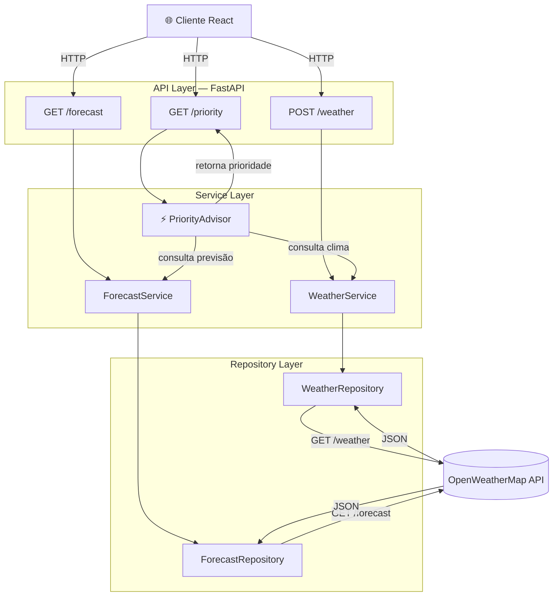

```mermaid
flowchart TD
    CLI["🌐 Cliente React"]

    subgraph API["API Layer — FastAPI"]
        EP1["POST /weather"]
        EP2["GET /forecast"]
        EP3["GET /priority"]
    end

    subgraph SVC["Service Layer"]
        WS["WeatherService"]
        FS["ForecastService"]
        PA["⚡ PriorityAdvisor"]
    end

    subgraph REPO["Repository Layer"]
        WR["WeatherRepository"]
        FR["ForecastRepository"]
    end

    EXT[("OpenWeatherMap API")]

    CLI -->|HTTP| EP1
    CLI -->|HTTP| EP2
    CLI -->|HTTP| EP3

    EP1 --> WS
    EP2 --> FS
    EP3 --> PA

    PA -->|consulta clima| WS
    PA -->|consulta previsão| FS
    PA -->|retorna prioridade| EP3

    WS --> WR
    FS --> FR

    WR -->|GET /weather| EXT
    FR -->|GET /forecast| EXT

    EXT -->|JSON| WR
    EXT -->|JSON| FR
```
